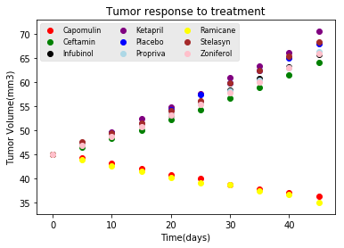
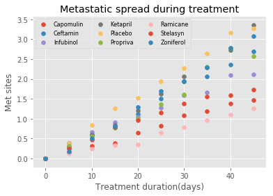
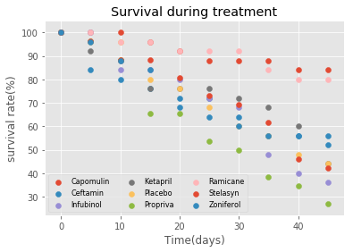
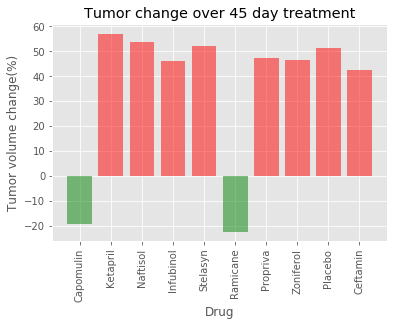

## Pymaceuticals Inc

While your data companions rushed off to jobs in finance and government, you remained adamant that science was the way for you. Staying true to your mission, you've since joined Pymaceuticals Inc., a burgeoning pharmaceutical company based out of San Diego, CA. Pymaceuticals specializes in drug-based, anti-cancer pharmaceuticals. In their most recent efforts, they've since begun screening for potential treatments to squamous cell carcinoma (SCC), a commonly occurring form of skin cancer.

As their Chief Data Analyst, you've been given access to the complete data from their most recent animal study. In this study, 250 mice were treated through a variety of drug regimes over the course of 45 days. Their physiological responses were then monitored over the course of that time. Your objective is to analyze the data to show how four treatments (Capomulin, Infubinol, Ketapril, and Placebo) compare.

To do this you are tasked with:

* Creating a scatter plot that shows how the tumor volume changes over time for each treatment.
* Creating a scatter plot that shows how the number of [metastatic](https://en.wikipedia.org/wiki/Metastasis) (cancer spreading) sites changes over time for each treatment.
* Creating a scatter plot that shows the number of mice still alive through the course of treatment (Survival Rate)
* Creating a bar graph that compares the total % tumor volume change for each drug across the full 45 days.


```python
#import Dependencies
import os
import pandas as pd
import matplotlib.pyplot as plt
import numpy as np
```


```python
#create filepath
trial_filepath = os.path.join("raw_data","clinicaltrial_data.csv")
mouse_filepath = os.path.join("raw_data","mouse_drug_data.csv")
```


```python
#read csv to data-frames
trial_df = pd.read_csv(trial_filepath)
mouse_df = pd.read_csv(mouse_filepath)
trial_df.head()
```


<div>
<style>
    .dataframe thead tr:only-child th {
        text-align: right;
    }

    .dataframe thead th {
        text-align: left;
    }

    .dataframe tbody tr th {
        vertical-align: top;
    }
</style>
<table border="1" class="dataframe">
  <thead>
    <tr style="text-align: right;">
      <th></th>
      <th>Mouse ID</th>
      <th>Timepoint</th>
      <th>Tumor Volume (mm3)</th>
      <th>Metastatic Sites</th>
    </tr>
  </thead>
  <tbody>
    <tr>
      <th>0</th>
      <td>b128</td>
      <td>0</td>
      <td>45.0</td>
      <td>0</td>
    </tr>
    <tr>
      <th>1</th>
      <td>f932</td>
      <td>0</td>
      <td>45.0</td>
      <td>0</td>
    </tr>
    <tr>
      <th>2</th>
      <td>g107</td>
      <td>0</td>
      <td>45.0</td>
      <td>0</td>
    </tr>
    <tr>
      <th>3</th>
      <td>a457</td>
      <td>0</td>
      <td>45.0</td>
      <td>0</td>
    </tr>
    <tr>
      <th>4</th>
      <td>c819</td>
      <td>0</td>
      <td>45.0</td>
      <td>0</td>
    </tr>
  </tbody>
</table>
</div>


```python
mouse_df.head()
```


<div>
<style>
    .dataframe thead tr:only-child th {
        text-align: right;
    }

    .dataframe thead th {
        text-align: left;
    }

    .dataframe tbody tr th {
        vertical-align: top;
    }
</style>
<table border="1" class="dataframe">
  <thead>
    <tr style="text-align: right;">
      <th></th>
      <th>Mouse ID</th>
      <th>Drug</th>
    </tr>
  </thead>
  <tbody>
    <tr>
      <th>0</th>
      <td>f234</td>
      <td>Stelasyn</td>
    </tr>
    <tr>
      <th>1</th>
      <td>x402</td>
      <td>Stelasyn</td>
    </tr>
    <tr>
      <th>2</th>
      <td>a492</td>
      <td>Stelasyn</td>
    </tr>
    <tr>
      <th>3</th>
      <td>w540</td>
      <td>Stelasyn</td>
    </tr>
    <tr>
      <th>4</th>
      <td>v764</td>
      <td>Stelasyn</td>
    </tr>
  </tbody>
</table>
</div>


```python
#merge the two data frames on Mouse Id
merge_df = pd.merge(trial_df, mouse_df, on = "Mouse ID", how = "outer")
merge_df.head()
```


<div>
<style>
    .dataframe thead tr:only-child th {
        text-align: right;
    }

    .dataframe thead th {
        text-align: left;
    }

    .dataframe tbody tr th {
        vertical-align: top;
    }
</style>
<table border="1" class="dataframe">
  <thead>
    <tr style="text-align: right;">
      <th></th>
      <th>Mouse ID</th>
      <th>Timepoint</th>
      <th>Tumor Volume (mm3)</th>
      <th>Metastatic Sites</th>
      <th>Drug</th>
    </tr>
  </thead>
  <tbody>
    <tr>
      <th>0</th>
      <td>b128</td>
      <td>0</td>
      <td>45.000000</td>
      <td>0</td>
      <td>Capomulin</td>
    </tr>
    <tr>
      <th>1</th>
      <td>b128</td>
      <td>5</td>
      <td>45.651331</td>
      <td>0</td>
      <td>Capomulin</td>
    </tr>
    <tr>
      <th>2</th>
      <td>b128</td>
      <td>10</td>
      <td>43.270852</td>
      <td>0</td>
      <td>Capomulin</td>
    </tr>
    <tr>
      <th>3</th>
      <td>b128</td>
      <td>15</td>
      <td>43.784893</td>
      <td>0</td>
      <td>Capomulin</td>
    </tr>
    <tr>
      <th>4</th>
      <td>b128</td>
      <td>20</td>
      <td>42.731552</td>
      <td>0</td>
      <td>Capomulin</td>
    </tr>
  </tbody>
</table>
</div>


```python
#To find the effect of each treatment, groupby Drug
#drug_df = pd.DataFrame(merge_df.groupby(["Drug","Timepoint"])["Tumor Volume (mm3)"].mean())
drug_df = pd.DataFrame(merge_df.groupby(["Drug","Timepoint"],as_index=False).agg({"Tumor Volume (mm3)": "mean"}))
drug_df.head()
```


<div>
<style>
    .dataframe thead tr:only-child th {
        text-align: right;
    }

    .dataframe thead th {
        text-align: left;
    }

    .dataframe tbody tr th {
        vertical-align: top;
    }
</style>
<table border="1" class="dataframe">
  <thead>
    <tr style="text-align: right;">
      <th></th>
      <th>Drug</th>
      <th>Timepoint</th>
      <th>Tumor Volume (mm3)</th>
    </tr>
  </thead>
  <tbody>
    <tr>
      <th>0</th>
      <td>Capomulin</td>
      <td>0</td>
      <td>45.000000</td>
    </tr>
    <tr>
      <th>1</th>
      <td>Capomulin</td>
      <td>5</td>
      <td>44.266086</td>
    </tr>
    <tr>
      <th>2</th>
      <td>Capomulin</td>
      <td>10</td>
      <td>43.084291</td>
    </tr>
    <tr>
      <th>3</th>
      <td>Capomulin</td>
      <td>15</td>
      <td>42.064317</td>
    </tr>
    <tr>
      <th>4</th>
      <td>Capomulin</td>
      <td>20</td>
      <td>40.716325</td>
    </tr>
  </tbody>
</table>
</div>


```python
drug_df["Drug"].unique()
```


    array(['Capomulin', 'Ceftamin', 'Infubinol', 'Ketapril', 'Naftisol',
           'Placebo', 'Propriva', 'Ramicane', 'Stelasyn', 'Zoniferol'], dtype=object)


```python
#create separate data-frames for each drug
Capomulin = drug_df[drug_df["Drug"] == "Capomulin"]
Ceftamin = drug_df[drug_df["Drug"] == "Ceftamin"]
Infubinol = drug_df[drug_df["Drug"] == "Infubinol"]
Ketapril = drug_df[drug_df["Drug"] == "Ketapril"]
Placebo = drug_df[drug_df["Drug"] == "Placebo"]
Propriva = drug_df[drug_df["Drug"] == "Propriva"]
Ramicane = drug_df[drug_df["Drug"] == "Ramicane"]
Stelasyn = drug_df[drug_df["Drug"] == "Stelasyn"]
Zoniferol = drug_df[drug_df["Drug"] == "Zoniferol"]
```


```python
Capomulin = plt.scatter (Capomulin["Timepoint"], Capomulin["Tumor Volume (mm3)"], c = "red")
Ceftamin = plt.scatter (Ceftamin["Timepoint"], Ceftamin["Tumor Volume (mm3)"],c = "green")
Infubinol = plt.scatter (Infubinol["Timepoint"], Infubinol["Tumor Volume (mm3)"],c = "black")
Ketapril = plt.scatter (Ketapril["Timepoint"], Ketapril["Tumor Volume (mm3)"],c = "purple")
Placebo = plt.scatter (Placebo["Timepoint"], Placebo["Tumor Volume (mm3)"],c = "blue")
Propriva = plt.scatter (Propriva["Timepoint"], Propriva["Tumor Volume (mm3)"],c = "lightblue")
Ramicane = plt.scatter (Ramicane["Timepoint"], Ramicane["Tumor Volume (mm3)"],c = "yellow")
Stelasyn = plt.scatter (Stelasyn["Timepoint"], Stelasyn["Tumor Volume (mm3)"],c = "brown")
Zoniferol = plt.scatter (Zoniferol["Timepoint"], Zoniferol["Tumor Volume (mm3)"],c = "pink")
```


```python
plt.xlabel("Time(days)")
plt.ylabel("Tumor Volume(mm3)")
plt.title("Tumor response to treatment")

plt.style.use('ggplot')

plt.legend((Capomulin,Ceftamin,Infubinol,Ketapril,Placebo,Propriva,Ramicane,Stelasyn,Zoniferol),\
           ("Capomulin","Ceftamin","Infubinol","Ketapril","Placebo","Propriva","Ramicane","Stelasyn","Zoniferol"),\
           scatterpoints=1, loc='upper left',ncol=3, fontsize=8)
plt.show()
```





```python
merge_df.head()
```


<div>
<style>
    .dataframe thead tr:only-child th {
        text-align: right;
    }

    .dataframe thead th {
        text-align: left;
    }

    .dataframe tbody tr th {
        vertical-align: top;
    }
</style>
<table border="1" class="dataframe">
  <thead>
    <tr style="text-align: right;">
      <th></th>
      <th>Mouse ID</th>
      <th>Timepoint</th>
      <th>Tumor Volume (mm3)</th>
      <th>Metastatic Sites</th>
      <th>Drug</th>
    </tr>
  </thead>
  <tbody>
    <tr>
      <th>0</th>
      <td>b128</td>
      <td>0</td>
      <td>45.000000</td>
      <td>0</td>
      <td>Capomulin</td>
    </tr>
    <tr>
      <th>1</th>
      <td>b128</td>
      <td>5</td>
      <td>45.651331</td>
      <td>0</td>
      <td>Capomulin</td>
    </tr>
    <tr>
      <th>2</th>
      <td>b128</td>
      <td>10</td>
      <td>43.270852</td>
      <td>0</td>
      <td>Capomulin</td>
    </tr>
    <tr>
      <th>3</th>
      <td>b128</td>
      <td>15</td>
      <td>43.784893</td>
      <td>0</td>
      <td>Capomulin</td>
    </tr>
    <tr>
      <th>4</th>
      <td>b128</td>
      <td>20</td>
      <td>42.731552</td>
      <td>0</td>
      <td>Capomulin</td>
    </tr>
  </tbody>
</table>
</div>


```python
#To find the metastatic sites change over time, groupby Drug
drug_meta_df = pd.DataFrame(merge_df.groupby(["Drug","Timepoint"],as_index=False).agg({"Metastatic Sites": "mean"}))
drug_meta_df.head()
```


<div>
<style>
    .dataframe thead tr:only-child th {
        text-align: right;
    }

    .dataframe thead th {
        text-align: left;
    }

    .dataframe tbody tr th {
        vertical-align: top;
    }
</style>
<table border="1" class="dataframe">
  <thead>
    <tr style="text-align: right;">
      <th></th>
      <th>Drug</th>
      <th>Timepoint</th>
      <th>Metastatic Sites</th>
    </tr>
  </thead>
  <tbody>
    <tr>
      <th>0</th>
      <td>Capomulin</td>
      <td>0</td>
      <td>0.000000</td>
    </tr>
    <tr>
      <th>1</th>
      <td>Capomulin</td>
      <td>5</td>
      <td>0.160000</td>
    </tr>
    <tr>
      <th>2</th>
      <td>Capomulin</td>
      <td>10</td>
      <td>0.320000</td>
    </tr>
    <tr>
      <th>3</th>
      <td>Capomulin</td>
      <td>15</td>
      <td>0.375000</td>
    </tr>
    <tr>
      <th>4</th>
      <td>Capomulin</td>
      <td>20</td>
      <td>0.652174</td>
    </tr>
  </tbody>
</table>
</div>


```python
#create separate data-frames for each drug
Capomulin = drug_meta_df[drug_meta_df["Drug"] == "Capomulin"]
Ceftamin = drug_meta_df[drug_meta_df["Drug"] == "Ceftamin"]
Infubinol = drug_meta_df[drug_meta_df["Drug"] == "Infubinol"]
Ketapril = drug_meta_df[drug_meta_df["Drug"] == "Ketapril"]
Placebo = drug_meta_df[drug_meta_df["Drug"] == "Placebo"]
Propriva = drug_meta_df[drug_meta_df["Drug"] == "Propriva"]
Ramicane = drug_meta_df[drug_meta_df["Drug"] == "Ramicane"]
Stelasyn = drug_meta_df[drug_meta_df["Drug"] == "Stelasyn"]
Zoniferol = drug_meta_df[drug_meta_df["Drug"] == "Zoniferol"]
```


```python
Capomulin = plt.scatter (Capomulin["Timepoint"], Capomulin["Metastatic Sites"])
Ceftamin = plt.scatter (Ceftamin["Timepoint"], Ceftamin["Metastatic Sites"])
Infubinol = plt.scatter (Infubinol["Timepoint"], Infubinol["Metastatic Sites"])
Ketapril = plt.scatter (Ketapril["Timepoint"], Ketapril["Metastatic Sites"])
Placebo = plt.scatter (Placebo["Timepoint"], Placebo["Metastatic Sites"])
Propriva = plt.scatter (Propriva["Timepoint"], Propriva["Metastatic Sites"])
Ramicane = plt.scatter (Ramicane["Timepoint"], Ramicane["Metastatic Sites"])
Stelasyn = plt.scatter (Stelasyn["Timepoint"], Stelasyn["Metastatic Sites"])
Zoniferol = plt.scatter (Zoniferol["Timepoint"], Zoniferol["Metastatic Sites"])
```


```python
plt.xlabel("Treatment duration(days)")
plt.ylabel("Met sites")
plt.title("Metastatic spread during treatment")
plt.legend((Capomulin,Ceftamin,Infubinol,Ketapril,Placebo,Propriva,Ramicane,Stelasyn,Zoniferol),\
           ("Capomulin","Ceftamin","Infubinol","Ketapril","Placebo","Propriva","Ramicane","Stelasyn","Zoniferol"),\
           scatterpoints=1, loc='upper left',ncol=3, fontsize=8)
plt.show()
```





```python
merge_df.head()
```


<div>
<style>
    .dataframe thead tr:only-child th {
        text-align: right;
    }

    .dataframe thead th {
        text-align: left;
    }

    .dataframe tbody tr th {
        vertical-align: top;
    }
</style>
<table border="1" class="dataframe">
  <thead>
    <tr style="text-align: right;">
      <th></th>
      <th>Mouse ID</th>
      <th>Timepoint</th>
      <th>Tumor Volume (mm3)</th>
      <th>Metastatic Sites</th>
      <th>Drug</th>
    </tr>
  </thead>
  <tbody>
    <tr>
      <th>0</th>
      <td>b128</td>
      <td>0</td>
      <td>45.000000</td>
      <td>0</td>
      <td>Capomulin</td>
    </tr>
    <tr>
      <th>1</th>
      <td>b128</td>
      <td>5</td>
      <td>45.651331</td>
      <td>0</td>
      <td>Capomulin</td>
    </tr>
    <tr>
      <th>2</th>
      <td>b128</td>
      <td>10</td>
      <td>43.270852</td>
      <td>0</td>
      <td>Capomulin</td>
    </tr>
    <tr>
      <th>3</th>
      <td>b128</td>
      <td>15</td>
      <td>43.784893</td>
      <td>0</td>
      <td>Capomulin</td>
    </tr>
    <tr>
      <th>4</th>
      <td>b128</td>
      <td>20</td>
      <td>42.731552</td>
      <td>0</td>
      <td>Capomulin</td>
    </tr>
  </tbody>
</table>
</div>


```python
#To find the survival rate, groupby drug & timepoint & count mouse id
survival_df = pd.DataFrame(merge_df.groupby(["Drug","Timepoint"],as_index=False).agg({"Mouse ID": "count"}))
survival_df.head()
```


<div>
<style>
    .dataframe thead tr:only-child th {
        text-align: right;
    }

    .dataframe thead th {
        text-align: left;
    }

    .dataframe tbody tr th {
        vertical-align: top;
    }
</style>
<table border="1" class="dataframe">
  <thead>
    <tr style="text-align: right;">
      <th></th>
      <th>Drug</th>
      <th>Timepoint</th>
      <th>Mouse ID</th>
    </tr>
  </thead>
  <tbody>
    <tr>
      <th>0</th>
      <td>Capomulin</td>
      <td>0</td>
      <td>25</td>
    </tr>
    <tr>
      <th>1</th>
      <td>Capomulin</td>
      <td>5</td>
      <td>25</td>
    </tr>
    <tr>
      <th>2</th>
      <td>Capomulin</td>
      <td>10</td>
      <td>25</td>
    </tr>
    <tr>
      <th>3</th>
      <td>Capomulin</td>
      <td>15</td>
      <td>24</td>
    </tr>
    <tr>
      <th>4</th>
      <td>Capomulin</td>
      <td>20</td>
      <td>23</td>
    </tr>
  </tbody>
</table>
</div>


```python
#create separate data-frames for each drug
Capomulin = survival_df[survival_df["Drug"] == "Capomulin"].reset_index()
Ceftamin = survival_df[survival_df["Drug"] == "Ceftamin"].reset_index()
Infubinol = survival_df[survival_df["Drug"] == "Infubinol"].reset_index()
Ketapril = survival_df[survival_df["Drug"] == "Ketapril"].reset_index()
Placebo = survival_df[survival_df["Drug"] == "Placebo"].reset_index()
Propriva = survival_df[survival_df["Drug"] == "Propriva"].reset_index()
Ramicane = survival_df[survival_df["Drug"] == "Ramicane"].reset_index()
Stelasyn = survival_df[survival_df["Drug"] == "Stelasyn"].reset_index()
Zoniferol = survival_df[survival_df["Drug"] == "Zoniferol"].reset_index()
```


```python
Capomulin
```


<div>
<style>
    .dataframe thead tr:only-child th {
        text-align: right;
    }

    .dataframe thead th {
        text-align: left;
    }

    .dataframe tbody tr th {
        vertical-align: top;
    }
</style>
<table border="1" class="dataframe">
  <thead>
    <tr style="text-align: right;">
      <th></th>
      <th>index</th>
      <th>Drug</th>
      <th>Timepoint</th>
      <th>Mouse ID</th>
    </tr>
  </thead>
  <tbody>
    <tr>
      <th>0</th>
      <td>0</td>
      <td>Capomulin</td>
      <td>0</td>
      <td>25</td>
    </tr>
    <tr>
      <th>1</th>
      <td>1</td>
      <td>Capomulin</td>
      <td>5</td>
      <td>25</td>
    </tr>
    <tr>
      <th>2</th>
      <td>2</td>
      <td>Capomulin</td>
      <td>10</td>
      <td>25</td>
    </tr>
    <tr>
      <th>3</th>
      <td>3</td>
      <td>Capomulin</td>
      <td>15</td>
      <td>24</td>
    </tr>
    <tr>
      <th>4</th>
      <td>4</td>
      <td>Capomulin</td>
      <td>20</td>
      <td>23</td>
    </tr>
    <tr>
      <th>5</th>
      <td>5</td>
      <td>Capomulin</td>
      <td>25</td>
      <td>22</td>
    </tr>
    <tr>
      <th>6</th>
      <td>6</td>
      <td>Capomulin</td>
      <td>30</td>
      <td>22</td>
    </tr>
    <tr>
      <th>7</th>
      <td>7</td>
      <td>Capomulin</td>
      <td>35</td>
      <td>22</td>
    </tr>
    <tr>
      <th>8</th>
      <td>8</td>
      <td>Capomulin</td>
      <td>40</td>
      <td>21</td>
    </tr>
    <tr>
      <th>9</th>
      <td>9</td>
      <td>Capomulin</td>
      <td>45</td>
      <td>21</td>
    </tr>
  </tbody>
</table>
</div>


```python
#calculate & add a new column for survival rate in %
Capomulin["Survival rate(%)"] = Capomulin["Mouse ID"] * 100 /Capomulin["Mouse ID"][0]
Ceftamin["Survival rate(%)"] = Ceftamin["Mouse ID"] * 100 /Ceftamin["Mouse ID"][0]
Infubinol["Survival rate(%)"] = Infubinol["Mouse ID"] * 100 /Infubinol["Mouse ID"][0]
Ketapril["Survival rate(%)"] = Ketapril["Mouse ID"] * 100 /Ketapril["Mouse ID"][0]
Placebo["Survival rate(%)"] = Placebo["Mouse ID"] * 100 /Placebo["Mouse ID"][0]
Propriva["Survival rate(%)"] = Propriva["Mouse ID"] * 100 /Propriva["Mouse ID"][0]
Ramicane["Survival rate(%)"] = Ramicane["Mouse ID"] * 100 /Ramicane["Mouse ID"][0]
Stelasyn["Survival rate(%)"] = Stelasyn["Mouse ID"] * 100 /Stelasyn["Mouse ID"][0]
Zoniferol["Survival rate(%)"] = Zoniferol["Mouse ID"] * 100 /Zoniferol["Mouse ID"][0]
```


```python
Capomulin = plt.scatter (Capomulin["Timepoint"], Capomulin["Survival rate(%)"])
Ceftamin = plt.scatter (Ceftamin["Timepoint"], Ceftamin["Survival rate(%)"])
Infubinol = plt.scatter (Infubinol["Timepoint"], Infubinol["Survival rate(%)"])
Ketapril = plt.scatter (Ketapril["Timepoint"], Ketapril["Survival rate(%)"])
Placebo = plt.scatter (Placebo["Timepoint"], Placebo["Survival rate(%)"])
Propriva = plt.scatter (Propriva["Timepoint"], Propriva["Survival rate(%)"])
Ramicane = plt.scatter (Ramicane["Timepoint"], Ramicane["Survival rate(%)"])
Stelasyn = plt.scatter (Stelasyn["Timepoint"], Stelasyn["Survival rate(%)"])
Zoniferol = plt.scatter (Zoniferol["Timepoint"], Zoniferol["Survival rate(%)"])
```


```python
plt.xlabel("Time(days)")
plt.ylabel("survival rate(%)")
plt.title("Survival during treatment")

plt.legend((Capomulin,Ceftamin,Infubinol,Ketapril,Placebo,Propriva,Ramicane,Stelasyn,Zoniferol),\
           ("Capomulin","Ceftamin","Infubinol","Ketapril","Placebo","Propriva","Ramicane","Stelasyn","Zoniferol"),\
           scatterpoints=1, loc='lower left',ncol=3, fontsize=8)

plt.show()
```





```python
merge_df.head()
```


<div>
<style>
    .dataframe thead tr:only-child th {
        text-align: right;
    }

    .dataframe thead th {
        text-align: left;
    }

    .dataframe tbody tr th {
        vertical-align: top;
    }
</style>
<table border="1" class="dataframe">
  <thead>
    <tr style="text-align: right;">
      <th></th>
      <th>Mouse ID</th>
      <th>Timepoint</th>
      <th>Tumor Volume (mm3)</th>
      <th>Metastatic Sites</th>
      <th>Drug</th>
    </tr>
  </thead>
  <tbody>
    <tr>
      <th>0</th>
      <td>b128</td>
      <td>0</td>
      <td>45.000000</td>
      <td>0</td>
      <td>Capomulin</td>
    </tr>
    <tr>
      <th>1</th>
      <td>b128</td>
      <td>5</td>
      <td>45.651331</td>
      <td>0</td>
      <td>Capomulin</td>
    </tr>
    <tr>
      <th>2</th>
      <td>b128</td>
      <td>10</td>
      <td>43.270852</td>
      <td>0</td>
      <td>Capomulin</td>
    </tr>
    <tr>
      <th>3</th>
      <td>b128</td>
      <td>15</td>
      <td>43.784893</td>
      <td>0</td>
      <td>Capomulin</td>
    </tr>
    <tr>
      <th>4</th>
      <td>b128</td>
      <td>20</td>
      <td>42.731552</td>
      <td>0</td>
      <td>Capomulin</td>
    </tr>
  </tbody>
</table>
</div>


```python
#Groupby drug & timepoint & find mean of tumor volume for each timepoint
bar_df = pd.DataFrame(merge_df.groupby(["Drug","Timepoint"],as_index=False).agg({"Tumor Volume (mm3)": "mean"}))
bar_df.head()
```


<div>
<style>
    .dataframe thead tr:only-child th {
        text-align: right;
    }

    .dataframe thead th {
        text-align: left;
    }

    .dataframe tbody tr th {
        vertical-align: top;
    }
</style>
<table border="1" class="dataframe">
  <thead>
    <tr style="text-align: right;">
      <th></th>
      <th>Drug</th>
      <th>Timepoint</th>
      <th>Tumor Volume (mm3)</th>
    </tr>
  </thead>
  <tbody>
    <tr>
      <th>0</th>
      <td>Capomulin</td>
      <td>0</td>
      <td>45.000000</td>
    </tr>
    <tr>
      <th>1</th>
      <td>Capomulin</td>
      <td>5</td>
      <td>44.266086</td>
    </tr>
    <tr>
      <th>2</th>
      <td>Capomulin</td>
      <td>10</td>
      <td>43.084291</td>
    </tr>
    <tr>
      <th>3</th>
      <td>Capomulin</td>
      <td>15</td>
      <td>42.064317</td>
    </tr>
    <tr>
      <th>4</th>
      <td>Capomulin</td>
      <td>20</td>
      <td>40.716325</td>
    </tr>
  </tbody>
</table>
</div>


```python
#create separate data-frames for each drug
Capomulin = bar_df[bar_df["Drug"] == "Capomulin"].reset_index()
Ceftamin = bar_df[bar_df["Drug"] == "Ceftamin"].reset_index()
Infubinol = bar_df[bar_df["Drug"] == "Infubinol"].reset_index()
Ketapril = bar_df[bar_df["Drug"] == "Ketapril"].reset_index()
Placebo = bar_df[bar_df["Drug"] == "Placebo"].reset_index()
Propriva = bar_df[bar_df["Drug"] == "Propriva"].reset_index()
Ramicane = bar_df[bar_df["Drug"] == "Ramicane"].reset_index()
Stelasyn = bar_df[bar_df["Drug"] == "Stelasyn"].reset_index()
Zoniferol = bar_df[bar_df["Drug"] == "Zoniferol"].reset_index()
Naftisol = bar_df[bar_df["Drug"] == "Naftisol"].reset_index()
```


```python
Capomulin
```


<div>
<style>
    .dataframe thead tr:only-child th {
        text-align: right;
    }

    .dataframe thead th {
        text-align: left;
    }

    .dataframe tbody tr th {
        vertical-align: top;
    }
</style>
<table border="1" class="dataframe">
  <thead>
    <tr style="text-align: right;">
      <th></th>
      <th>index</th>
      <th>Drug</th>
      <th>Timepoint</th>
      <th>Tumor Volume (mm3)</th>
    </tr>
  </thead>
  <tbody>
    <tr>
      <th>0</th>
      <td>0</td>
      <td>Capomulin</td>
      <td>0</td>
      <td>45.000000</td>
    </tr>
    <tr>
      <th>1</th>
      <td>1</td>
      <td>Capomulin</td>
      <td>5</td>
      <td>44.266086</td>
    </tr>
    <tr>
      <th>2</th>
      <td>2</td>
      <td>Capomulin</td>
      <td>10</td>
      <td>43.084291</td>
    </tr>
    <tr>
      <th>3</th>
      <td>3</td>
      <td>Capomulin</td>
      <td>15</td>
      <td>42.064317</td>
    </tr>
    <tr>
      <th>4</th>
      <td>4</td>
      <td>Capomulin</td>
      <td>20</td>
      <td>40.716325</td>
    </tr>
    <tr>
      <th>5</th>
      <td>5</td>
      <td>Capomulin</td>
      <td>25</td>
      <td>39.939528</td>
    </tr>
    <tr>
      <th>6</th>
      <td>6</td>
      <td>Capomulin</td>
      <td>30</td>
      <td>38.769339</td>
    </tr>
    <tr>
      <th>7</th>
      <td>7</td>
      <td>Capomulin</td>
      <td>35</td>
      <td>37.816839</td>
    </tr>
    <tr>
      <th>8</th>
      <td>8</td>
      <td>Capomulin</td>
      <td>40</td>
      <td>36.958001</td>
    </tr>
    <tr>
      <th>9</th>
      <td>9</td>
      <td>Capomulin</td>
      <td>45</td>
      <td>36.236114</td>
    </tr>
  </tbody>
</table>
</div>


```python
Capomulin_chng = (Capomulin["Tumor Volume (mm3)"][9] - \
                  Capomulin["Tumor Volume (mm3)"][0])* 100 / Capomulin["Tumor Volume (mm3)"][0]
Ceftamin_chng = (Ceftamin["Tumor Volume (mm3)"][9] - \
                  Ceftamin["Tumor Volume (mm3)"][0])* 100 / Ceftamin["Tumor Volume (mm3)"][0]
Infubinol_chng = (Infubinol["Tumor Volume (mm3)"][9] - \
                  Infubinol["Tumor Volume (mm3)"][0])* 100 / Infubinol["Tumor Volume (mm3)"][0]
Ketapril_chng = (Ketapril["Tumor Volume (mm3)"][9] - \
                  Ketapril["Tumor Volume (mm3)"][0])* 100 / Ketapril["Tumor Volume (mm3)"][0]
Placebo_chng = (Placebo["Tumor Volume (mm3)"][9] - \
                  Placebo["Tumor Volume (mm3)"][0])* 100 / Placebo["Tumor Volume (mm3)"][0]
Propriva_chng = (Propriva["Tumor Volume (mm3)"][9] - \
                  Propriva["Tumor Volume (mm3)"][0])* 100 / Propriva["Tumor Volume (mm3)"][0]
Ramicane_chng = (Ramicane["Tumor Volume (mm3)"][9] - \
                  Ramicane["Tumor Volume (mm3)"][0])* 100 / Ramicane["Tumor Volume (mm3)"][0]
Stelasyn_chng = (Stelasyn["Tumor Volume (mm3)"][9] - \
                  Stelasyn["Tumor Volume (mm3)"][0])* 100 / Stelasyn["Tumor Volume (mm3)"][0]
Zoniferol_chng = (Zoniferol["Tumor Volume (mm3)"][9] - \
                  Zoniferol["Tumor Volume (mm3)"][0])* 100 / Zoniferol["Tumor Volume (mm3)"][0]
Naftisol_chng = (Naftisol["Tumor Volume (mm3)"][9] - \
                  Naftisol["Tumor Volume (mm3)"][0])* 100 / Naftisol["Tumor Volume (mm3)"][0]
```


```python
#create a dataframe with the above info
tumor_chng = pd.DataFrame({"Drug": ['Capomulin', 'Ketapril', 'Naftisol', 'Infubinol', 'Stelasyn',
                                    'Ramicane', 'Propriva', 'Zoniferol', 'Placebo', 'Ceftamin'],
                           "Tumor change" : [Capomulin_chng, Ketapril_chng, Naftisol_chng, Infubinol_chng,
                                             Stelasyn_chng, Ramicane_chng, Propriva_chng, Zoniferol_chng,
                                             Placebo_chng, Ceftamin_chng]
                         })
tumor_chng
```


<div>
<style>
    .dataframe thead tr:only-child th {
        text-align: right;
    }

    .dataframe thead th {
        text-align: left;
    }

    .dataframe tbody tr th {
        vertical-align: top;
    }
</style>
<table border="1" class="dataframe">
  <thead>
    <tr style="text-align: right;">
      <th></th>
      <th>Drug</th>
      <th>Tumor change</th>
    </tr>
  </thead>
  <tbody>
    <tr>
      <th>0</th>
      <td>Capomulin</td>
      <td>-19.475303</td>
    </tr>
    <tr>
      <th>1</th>
      <td>Ketapril</td>
      <td>57.028795</td>
    </tr>
    <tr>
      <th>2</th>
      <td>Naftisol</td>
      <td>53.923347</td>
    </tr>
    <tr>
      <th>3</th>
      <td>Infubinol</td>
      <td>46.123472</td>
    </tr>
    <tr>
      <th>4</th>
      <td>Stelasyn</td>
      <td>52.085134</td>
    </tr>
    <tr>
      <th>5</th>
      <td>Ramicane</td>
      <td>-22.320900</td>
    </tr>
    <tr>
      <th>6</th>
      <td>Propriva</td>
      <td>47.241175</td>
    </tr>
    <tr>
      <th>7</th>
      <td>Zoniferol</td>
      <td>46.579751</td>
    </tr>
    <tr>
      <th>8</th>
      <td>Placebo</td>
      <td>51.297960</td>
    </tr>
    <tr>
      <th>9</th>
      <td>Ceftamin</td>
      <td>42.516492</td>
    </tr>
  </tbody>
</table>
</div>


```python
#use green to indicate negative tumor change & red to indicate positive tumor change
plt.bar(tumor_chng[tumor_chng["Tumor change"] > 0].index, tumor_chng[tumor_chng["Tumor change"] > 0]["Tumor change"],\
        color='red', alpha=0.5, align="edge")
plt.bar(tumor_chng[tumor_chng["Tumor change"] <= 0].index, tumor_chng[tumor_chng["Tumor change"] <= 0]["Tumor change"],\
        color='green', alpha=0.5, align="edge")

# Create the ticks for our bar chart's x axis
tick_locations = [value + 0.4 for value in tumor_chng.index]
plt.xticks(tick_locations, tumor_chng["Drug"], rotation="vertical")

plt.xlabel("Drug")
plt.ylabel("Tumor volume change(%)")
plt.title("Tumor change over 45 day treatment")

plt.show()
```




